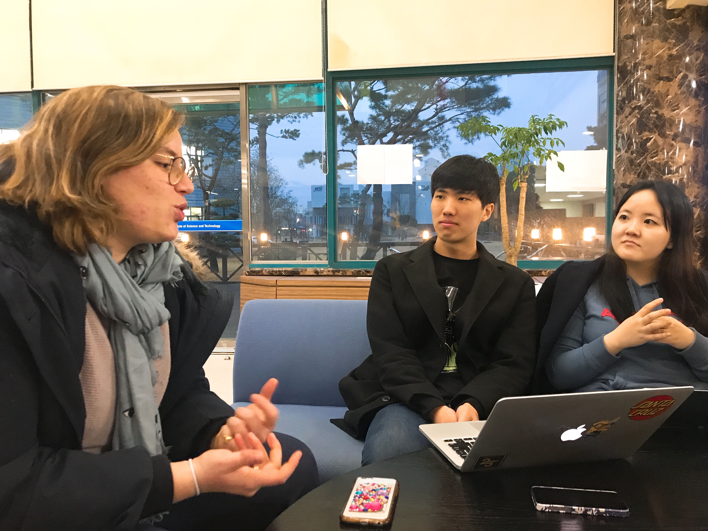
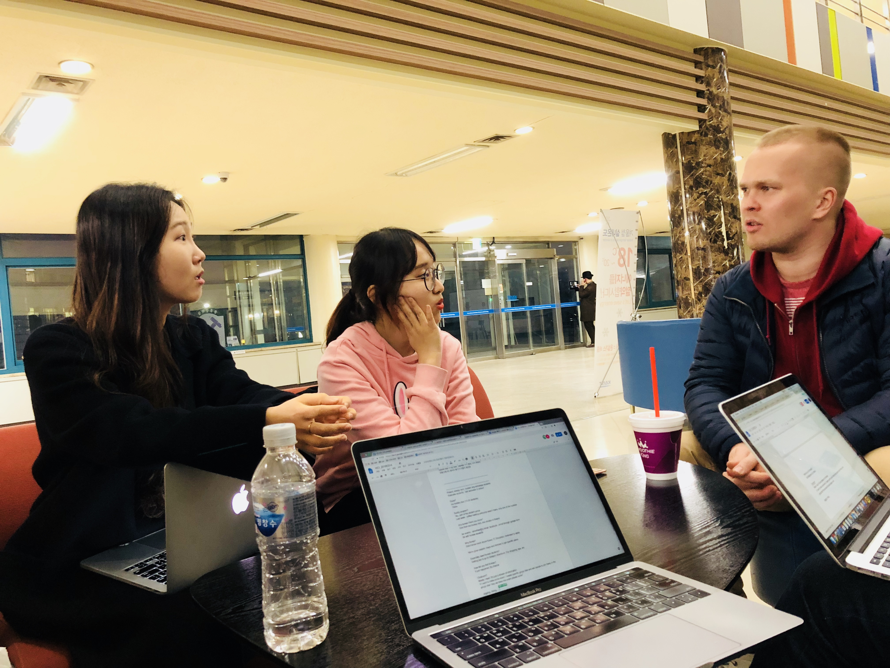

# Target user population
Exchange students in KAIST

# Experience
Redesign how exchange students in KAIST interact with domestic students

# Observation and Interviews
All team members participated all interviews.
We summarized the interesting points we thought during the interview. They are interesting not only because of the contents itself, but the interviewee emphasized them through nonverbal cues. For the task, we first thought of finding a person to eat together with (either Koreans or foreigners because they could feel uncomfortable when we limited to Koreans), but it might affect to their real schedule so we just asked them to imagine about it.

## Interviewee 1
### Profile
This interviewee is a female exchange student from France. She is 22 years old. She is currently a graduate student in Master course. She participates in the buddy program that is provided by ISSS. She is in KAIST orchestra and student choir Chorus. We think this interviewee is one of the **extreme users**, because typically exchange students don’t join the club where the majority of members is Korean students. Both clubs where this interviewee joined are not that much opened to exchange students (2 foreigners out of 80 in KAIST orchestra and 1 foreigner out of 70 in Chorus) compared to other foreigner-friendly clubs such as TITANS. This interviewee is related to our Experience because she poured her maximum effort to contact Korean-majority clubs and eventually get into these clubs.

### Summary of the interview and interesting points
- Opinions on the buddy program
  - The interviewee mentioned that she felt “superficial” when she hang out with her buddies - she felt buddies were friendly because buddies had to do it.
  - While she thought the purpose of the buddy program is good, the students who participate the program has not enough English skills to communicate.
  - She also shared what happened in detail: Korean buddies and exchange students walked separately, talked separately, and when the exchange students said something to Korean buddies, they had to talk each other to understand what she said to them.
- Getting information
  - The interviewee mentioned that it was good to have website like KAIST Portal since it provides all the information at one place.
  - However, she claimed that there are limited translated contents. She typically get complete information from ISO or ISSS (organization for foreigners in KAIST)
- Scheduling with other people
  - While the interview prefers to eat meal with other people, she thinks it is hard to schedule in advance because everyone has their own schedule. Instead, she goes to cafeteria when she wants and eat together if there are people already eating food.
- Being friend with Koreans
  - The interviewee mentioned that it was easier to get along with those who don’t have much domestic relationship such as researcher, PhD and students from Seoul campus.

## Interviewee 2
### Profile
Second interviewee is a male exchange student from Finland. He is taking the last semester of graduate course, majoring nuclear engineering. He is in TITANS, a frisbee club with lots of international students (34 foreigners out of 43). He also joins Ice Hockey club, a Korean majority club. He also participates buddy program. This interviewee is related to our Experience because we needed an interviewee who is in both foreigner-organized club and domestic-organized club and he was the one. 

### Summary of the interview and interesting points
- Events that interviewee participated / want to participate in to interact with domestic students
  - The interviewee participated in hiking with other students. However, in this event, there was a very few Korean students. He was little disappointed because he expected more Korean students to participate events foreigners organized. 
  - The interviewee is very willing to participate in other experiences if there are any. Especially, he wants to experience Korean cultures like temple stay.
- Situations when Koreans are needed
  - He needed Korean students when he needs to grab a taxi. It was very hard to communicate with taxi driver. 
  - He also needed a help from Korean students while he is doing homework. 

    
## Interviewee 3
### Profile
The last interviewee is a male exchange student from France. He is a graduate student major in material science. He joins TITANS and participates in buddy program. This interviewee is related to our Experience because he has a few and limited experience interacting with domestic students in KAIST.

### Summary of the interview and interesting points
- Getting information 
  - He heard about only a few information about clubs, mostly international clubs, at the beginning of the semester. It was hard to have information about other clubs (Clubs that are mainly run by Korean).
- Meeting Koreans in events
  - He met a few Koreans in Pojangmacha, an event held by ISO (International Student Organization) and a few in the party held by material science dept. 
  - But he doesn’t speak with them that much when meeting in social events because of language barrier.
- Hanging out with Koreans
  - He goes out with buddies (ex. Karaoke) but sometimes he feels it is difficult to communicate with them.
  - He meets Koreans in class or in group project, but he feels awkward to speak to Korean and it is hard to make a good, true Korean friend through these.
  - He has no other chances to meet Koreans although he wants to meet more.
- Meeting others in KAIST
  - When he has a meal, he just goes to cafeteria and always find his international friends eating there.
  - He wants some friends to travel around Korea together
- Overall life in Korea
  - It is the first time being in Korea, and he tries to experience many of Korean cultures. He practices using chopsticks, eating spicy food, and traveling around Korea although he misses french food sometimes.

# Needs
- **Understand** announcements & information on groups/events in KAIST written in Korean
  - Interviewee 1 mentioned that she can only get information from international community because the official route does not provide properly translated information. From this view, we thought that exchange students have needs to understand what’s happening in the campus by their own.
- **Make** true Korean friends 
  - Interviewee 1 mentioned that she felt superficial in the events organized by buddy program. Interviewee 3 said he felt awkward to speak to Korean. Both interviewee wanted more natural relationship with Korean students. 
- **Have** meal together
  - Interviewee 1 and 3 both said that even though they want to find someone to eat together, they don’t actively find someone but just go to cafeteria and get together with those who are already there. Interviewee 1 mentioned that the reason why she doesn’t find someone is that it is hard to make appointments because of the schedule of individuals. We spotted that they have implicit needs of finding someone to eat together.
- **Advertise** events organized by foreign students society to domestic students society
  - Interviewee 2 mentioned that he expected Korean students to participate in hiking / events. However, Korean students (including interviewers) were not noticed and we thought that there was not enough advertisement about this events. From this view, we thought that exchange students need a method to advertise the events organized by exchange students to Korean students. 
- **Participate** in (unofficial) one-off group events
  - Interviewee 2 said that he expected more popup events to interact with other Korean students. From this view we thought that exchange students have needs to participate in one-off group events. 
- **Communicate** with people outside of the campus easily
  - Interviewee 2 told us that there were situations when Korean students are needed, such as grabbing a taxi, because it was hard to communicate with taxi driver. So from this view, we realize that exchange students have needs to communicate well with people outside of the campus, 
- **Get** (unofficial) information on groups/events in KAIST
  - At the beginning of the semester, interviewee 3 got information about international clubs but there was no chance to get information about other clubs (especially for domestic-organized club)
- **Remove** language barrier (Korean, English)
  - Interviewee 3 meets some Koreans in social events such as Pojangmacha held by ISO  or a party held by his department, but he thought it is difficult to communicate with Koreans deeply and freely because he doesn’t speak korean well. Also, he sometimes felt difficult to communicate with his buddies in English.
- **Find** travel-mate
  - Interviewee 3 mentioned that he wants to travel around Korea to experience more but he felt he needs more friends to go with him. He thinks a group of people is better than being alone while traveling.
- **Eat** food from home country
  - Interviewee 3 mentioned that he tries to experience and get used to Korean culture but he misses his hometown food sometimes.

# Insights
- Some social interaction is more likely to be organized “by chance”. 
  - For instance, when they’re looking for someone to have meal together, they first go to cafeteria with no plans and search for some old faces. If there is, they do not hesitate to join them(Interviewee 1,2,3). This is indeed an unusual behavior in a perspective of Korean, as Koreans would make an appointment in advance in a similar case. Most Koreans used to have plan on whom to share details in their personal lives, whereas exchange student - or European - don’t obsessed with being a part in a group in this very case.  
This shows that we should be aware of the fact that two populations have different social dynamics and a deeper observation on the differences must be preceded in order to truly understand and investigate the needs of the others’. 
- Exchange student faces some difficulties in coming up to Korean domestic students.
  - Some domestic students have difficulties in reaching to exchange students although they have a huge urge deep in mind to do so. Not surprisingly, exchange students also have a similar issue. As part of a small minority population, it is a burden to cross over their safety zone with no confirmed facts on whom the person in their front might be. Apparently, they prefer to avoid a situation of being neglected, and thus would not reach out their hands first before they convince themselves on personality of people they would meet. Someone with an open-mind is necessary to them. (Interviewee 1)
- In each activity, people have preference of their own on either carrying out by oneself or as a group. 
  - For example, in terms of jogging, some prefer to jog by themselves as keeping their own pace(Interviewee 3), while some others prefer to have jogging in a group. In case of traveling, the more safety issue is expected to which they travel around(a new place, not suitable platform for non-Korean speaker, far apart from the original home ground), the more people tend to form and move in a group(Interviewee 3). 
- Not all exchange students speak English fluent. Language barrier is not a sole matter of domestic student. Some exchange students face difficulties in fully expressing their opinion as well. (interviewee 2)
- A pivot is necessary for one to be involved in a new social interaction.
  - Mostly, new social relationship is created if someone has a personal willing to transit one’s current (social) status, or there’s an external barrier forcing one to do so - for example, facing/resolving an issue, joining a new club, or having a group project. 
- KAIST courses requires too much of time and effort, thereby one could not set aside much of his time on other issues.(Interviewee 1,3).
- Korean, in a perspective of foreigner, seems to be afraid of speaking in English and try to avoid those difficult and embarrassing circumstances(Interviewee 1).
- Exchange students felt easier to get close to whom taking minor proportion in domestic social community, such as PhD, researcher, or whom commutes between Daejeon and Seoul weekly(Interviewee 1).
  - Someone well-adapting to the normal KAIST lifestyle, whom being considered as having a concrete standard in terms of relations in KAIST society (mostly undergraduates), is hard to be reached out first by others.
- Exchange students are very open to Korean culture. 
  - They would like to get to know Korea - they keep practicing to use chopsticks skillfully, they plan to travel indigenous. Some express a disappointment on themselves as they don’t speak Korean as they anticipate(interviewee 2,3). In the same context, they often charge off the presence language barrier to their level of using Korean.
- Exchange students do not felt much necessity on finding mates to share meal with.

# Studio Reflection
We would have more clear description on how our “needs” are derived from the interview; which seemed a bit mis-aligned at that moment. Contents in “insights” can be used as guide lines in this case.
In documenting, we reflected the comment above. We first described the interview question/answer concisely. We then matched each ten “needs” with interview contents as following: we describe whom the idea is originally derived from, distinguished each cases in terms corresponding population (whether it is restricted to some population or it is indeed a matter in general).
