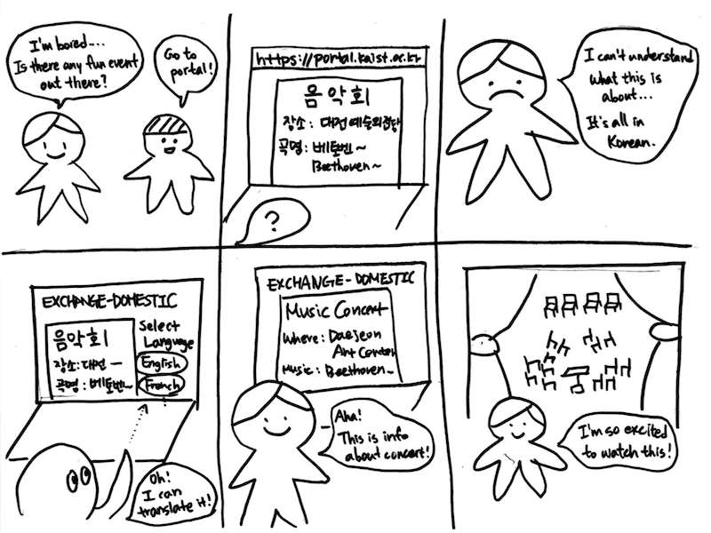
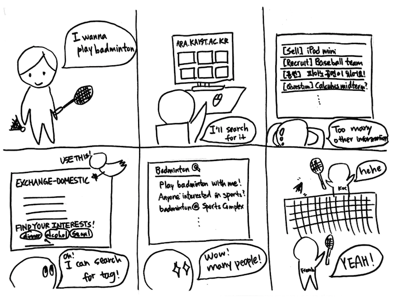
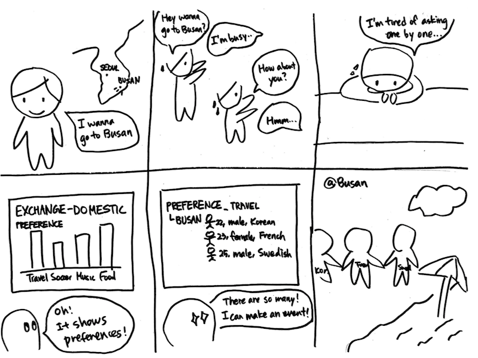

Final team name: String Quartet

# POV
**Exchange students in KAIST** need a way to **be socially more involved with KAIST domestic student society**, because **language barrier and isolated channel for communication make exchange students hard to come up in KAIST domestic student society**

# Persona

- Basic Information
  - Nationality: European (French)
  - Occupation
    - Graduate Student
    - Material Science Major
  - Gender: Male
  - Language
    - French: Native
    - English: Excellent
    - Korean: Poor
- Motivations
  - As a newcomer to Korea, he wants to be engaged more in Korean culture and society.
  - He needs someone to have meal, travel, workout, participate in club activities with.
- Belief
  - If he is able to reach information easier, he would get to know people better.
- Preferences
  - Prefer one-time informal events over repeated events
  - He prefers to workout by himself. However, in terms of traveling, he prefers to be in a group
- Goals
  - Wants to make “True friends”
  - Deeper understanding on Korean culture
- Scenario
  - “I came to Korea because I’m curious about Asia in overall. I want to experience about various things related to Korea, such as cultures. I arrived here about a month ago, but I still feel not engaged enough with Korean because I mostly meet other foreign exchange students, not domestic students.”

# HMW Questions
- How might we make people with different personalities participate?
- How might we increase accessibility to information?
- How might we personalize information for individuals?
- How might we connect people with similar taste? 
- How might we help exchange students outside of the campus?
- How might we make more interesting activities?
- How might we make campus more friendly to exchange students?
- How might we introduce Korean culture?
- How might we encourage exchange students to actually meet domestic students?
- How might we involve existing organization (to our project)?

## Top 3 HMW Questions
We chose top 3 HMW Questions by voting, and each team member has infinite votes (choose any HMW questions as they think it's good)
- How might we increase accessibility to information?
- How might we personalize information for individuals?
- How might we encourage exchange students to actually meet domestic students?

# Solution ideas for HMW questions

### How might we increase accessibility to information?
- Crawl data from url - so that people who write posts only write url and don’t need to post the same thing again
- Automatically upload posts related to exchange students that are uploaded on portal
- Summarize the information
- Upload representative photo about event so that people can know what the event is about
- Translate contents into user’s mother language - user can select which language to see
- Reward people who contributed translation
- Star interesting events and see starred events at one place
- Search all events based on tag query
- Email interested user when new events are created
- Notify users by smartphone notification when the events they are interested in are created

### How might we personalize information for individuals?
- Add tags to posts
- Collect preference data when a user first register
- Update preference data based on events that the user participated before
- Provide statistics about all users preference
- Recommend events that are not directly related to user’s preference but popular at that moment
- Selectively show related posts using AI
- Tell users why selected events are shown to them
- Functionality to allow users to show interest (but not actually participate)
- Show how many people are joining to the event in real-time
- Voting system to express opinions about events

### How might we encourage exchange students to actually meet domestic students?
- Recommend games that don’t require a lot of language fluency
- Find people nearby who wants to hang out (spatial)
- Find people who wants to hang out “right now” (temporal)
- Show contact information and link it so that users can send text message instantly
- Share users schedule with others
- Synchronize external schedule service (such as Google calendar)
- Notify users 10 minutes before the events starts
- Advertise cafes and provide users a cafe coupon
- Simplify reservation system and link to URS (urs.kaist.ac.kr)
- Reward users who upload pictures taken in the event

## Top 3 Solution ideas
Top 3 solution ideas were selected by team members, and each member can choose up to 3 solution ideas. First solution idea got same number of votes with one another idea, so we did one more round of voting.
- Translate contents into user’s mother language - user can select which language to see
- Add tags to posts
- Provide statistics about all users preference 

# Storyboards for solution ideas
#### Translate contents into user’s mother language - user can select which language to see

#### Add tags to posts

#### Provide statistics about all users preference 

# Studio reflections
- There was a feedback that our persona’s goal and HMW questions were not relevant enough. We thought that our persona’s goal focuses on making friend while HMW question focuses on event information. Since HMW questions were narrower than persona’s goal, we revisited our POV and changed it to be more broad. In consequence, we also revisited HMW questions and fixed them to fit with new POV.
  - Previous POV: **Exchange students in KAIST** need a way to **understand/provide/get information on social events/interaction in KAIST**, because *(same with final POV)*.
- One suggestion mentioned that important information are sent via email and they are translated in English. Also, they thought this is enough for exchange students. However, during interview we noticed that exchange students had needs to get more information about **informal** information. 
- There were some suggestions about our solutions.
  - Some organizations upload post only in Korean because they do not want exchange students to know about it. 
  - Some information about academic departments are already posted in English by ISSS or student council.
- The three HMW seem like solution driven and too narrow. Thus, we rephrased our HMW to some other sentences meaning similar way.
  - old1: HMW customize/fit/categorize/cluster information for individuals?
  - new1: HMW personalize information for individuals?
  - old2: HMW know preference of events of exchange students? 
  - new2: HMW personalize information for individuals?
  - old3: HMW gather information on on school events in one place?
  - new3: HMW increase accessibility to information?

