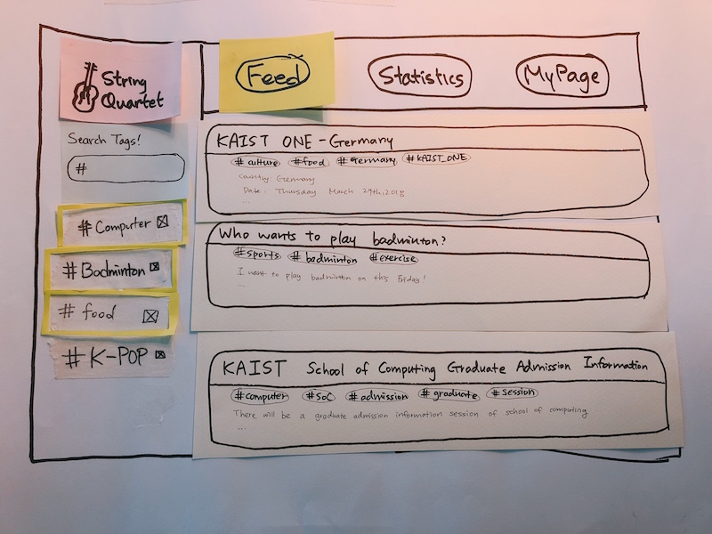
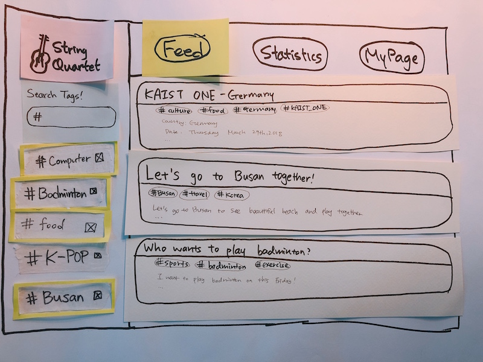
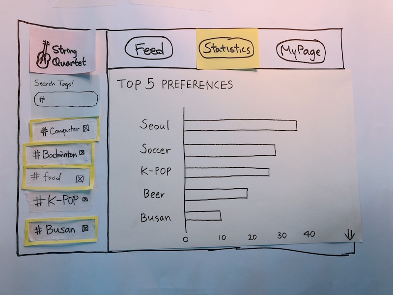
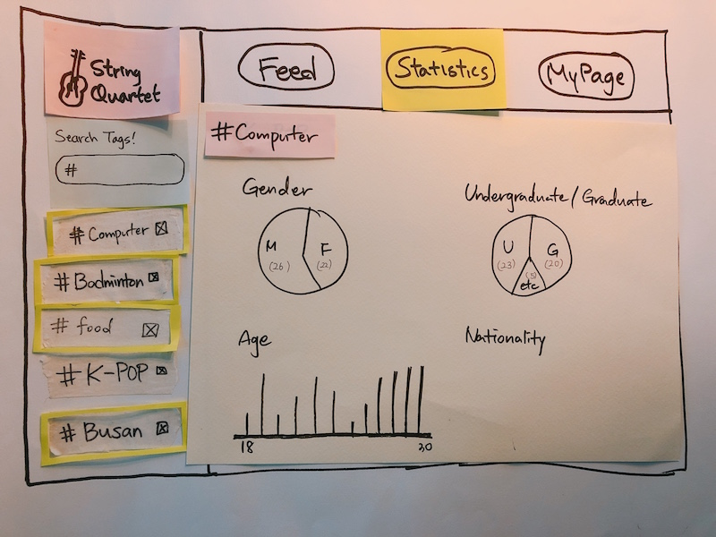

Team name: String Quartet

# Photos of our prototype

This is the main screen of our prototype. In this page, ‘Feed’ column is selected. On the left side there is Tag Search Bar and Tag List. Users can type into Tag Search Bar (we used transparancy to simulate input field) in order to add more tags into the Tag List. Some tags are activated - user can deactivate the tag by clicking it again. On the main page, users can see what events are currently opened. The feed is filled with events which contain at least one of the activated tags.

After user searched ‘#Busan’ tag, the Tag List is changed (compare with first photo.)

This is the main screen users can see when ‘Statistics’ column is selected. By default, top 5 popular tags are shown. Users can also scroll down from this page (which is drawn in paper prototype by arrow on the bottom-left side of the page)

After users scroll down, they can find more detailed information about highlighted tags. Users may keep scroll down to see other tags (in the order of highlighted tags in the Tag List) or scroll up to see previous tag information.

# Participants
All participants are exchange students, which fit with our target users. Also, all of our group members were in all three testing sessions.

### Participant 1 (P1)
- Age: 23
- Gender: Male
- Nationality: French
- Dept: Computer Science
- Status: Graduate student, 1st year
- We asked him to help us in the library.

### Participant 2 (P2)
- Age: 19
- Gender: Female
- Nationality: Azerbaijani
- Dept: Computer Science
- Status: Undergraduate student, 2nd year
- We asked her to participate our testing in Tuesday class.

### Participant 3 (P3)
- Age: 20
- Gender: Male
- Nationality: Indian
- Dept: Computer Science
- Status: Undergraduate student, 3rd year
- We asked him to participate our testing in Tuesday class.

# Briefing

### Background
In this project, we are trying to provide easier ways for exchange students to meet people and be involved in events held in KAIST. In order to achieve this, we are designing a new website. In our website, users are able to create events and advertise it to other users, search for existing events and participate them (using ‘Feed’ page), or learn who are interested in which kind of events (using ‘Statistics’ page.) We had built a paper prototype of the website, and you will be asked to finish some tasks. Please be aware that you are interacting with a website.

### Purpose
The purpose of our current prototype and this testing session is to observe if users understand how to search events currently opened and get information about how many people are interested about specific topics. This prototype does not include functionality to create a new events.

# Tasks

- Find an event visiting Busan.
- Find the tag that has the highest preference.
- Find how many undergraduate students are interested in computer.

# Observations

- Observations related to Tag List
  - Don’t understand what the Tag List means
    - Criticality: Medium
    - Participants who run into this problem: P1
    - Improvement plan: Detailed description of objects and their functionalities on the default screen should be provided in advance.
  - Don’t know if tags on the list are clickable to inactivate or activate
    - Criticality : High
    - Participants who run into this problem: P2
    - Improvement plan: This problem is unavoidable unless we are not using paper prototype. In computer prototype, we can slightly highlight tags in Tag List so that users can understand it is clickable.
  - Do not get the meaning of activation/inactivation/deletion of tags
    - Criticality : High
    - Participants who run into this problem: P2, P3
    - Improvement plan: Since this problem is critical and activation feature is also related to other observations, we might have to redesign (or even remove) activation feature of tags in Tag List. 
- Observations related to Tag Search Bar
  - Search for the tags that is not available
    - Criticality: Low
    - Participants who run into this problem: P1, P2
    - Improvement plan: Add tag auto-completion and tag selection features into Tag Search Bar
  - Add the tag that is already existed in the Tag List
    - Criticality: Low
    - Participants who run into this problem: P3
    - Improvement plan: Highlight Tag Search Bar into red and add a message below the bar that tells user the tag already exists.
- Observations related to 'Statistics' main page
  - Don’t understand the meaning of numbers shown in ‘Statistics’ - ‘Top 5 preference’
    - Criticality : Low
    - Participants who run into this problem: P1, P2
    - Improvement plan: More clear verbal description (ex: number of people) is needed.
  - Click on the name of tag in ‘Top 5 preference’ but nothing was shown
    - Criticality : Medium
    - Participants who run into this problem: P2, P3
    - Improvement plan : A reaction after a click to show the detailed information on the preference on each tag might be implemented further. If we don’t plan to provide any detailed information after clicking tag in the ‘top 5 preference’ page, we should give concrete visuals on the graph so that users can conclude nothing will happen by clicking it.
  - The arrow pointing down in ‘Statistics’ was not noticable
    - Criticality : High
    -  Participants who run into this problem: P1, P2, P3
    - Improvement plan : Change the arrow to scroll bar. Redesign the way this object looks as visible as possible.
  - Don’t know that Tag List also affects to page shown in ‘Statistics’
    - Criticality : Medium
    - Participants who run into this problem: P3
    - Improvement plan : Add visual effects (something that “physically” connects Tag List and main page) on Tag List so that user can understand current statistics main page is corresponding to the tags in Tag List.
- Others
  - Click the main logo of the string quartet because the participant thought it will bring back to the main page, but it didn’t
    - Criticality : Low
    - Participants who run into this problem: P3
    - Improvement plan : Add feature so that when the logo is clicked the screen goes back to Feed page.

# Individual reflections

## Seohui Bae
#### What role did you play in each round?
I was an observer in the first round (P1),  a facilitator in the second round (P2), and a computer in the third round (P3). 

#### What were some of the difficulties you faced playing the role(s)?
As an observer, it was hard to catch a subtle difference on the expected and actual behaviour unless the behavioural process they execute was unexpected. As a facilitator, I provide a cue to the participant when they are facing some difficulties. It was a matter of concern to decide the amount of information I provide at each point. The cue that I provide must be just enough to step forward by resolving facing at the very moment, while not so much in depth (nearly a whole solution), so that the task is conquerable at once. It was hard to manage the depth of cue that I provide.
As a computer, and as a paper prototyping requires laborious process when executing, I was not able to fully concentrate on the task that computer is expected to do. I sometimes miss some response planned in advance, and easily get distracted by unexpected behaviour of the participant such as typing down a tag which are not prepared at the moment. 

#### In what way was paper prototyping useful in your project?
As temporal scale is pretty slow in paper prototyping (as it takes for a while to react to the user’s request), it was able to catch the unexpected behaviour of the user in detail.  Some unexpected behaviour that seemed natural and intuitive might hardly be observed if temporal scale is too fast. Responses that are likely be withdrawn and discarded were observable in in paper prototyping and this enables us to include most issues that would raise in user interaction.

#### What did your paper prototype not cover or test?
There were several issues due to the property of paper prototyping itself.  This includes lack of implementation on some functionalities that require immediate response, for instance, which are mostly unable to be resolved as long as we use paper in the prototyping stage.

## Saelyne Yang

#### What role did you play in each round?
I was a computer in the first round (P1), an observer in the second (P2) and a facilitator in the third (P3) round of test sessions.

#### What were some of the difficulties you faced playing the role(s)?
As a computer, it was hard to respond immediately to ensure the interaction to users. Especially, when the user types in certain keyword for tags, I had to write down the keyword on other piece of paper and add it - it took a quite long time. Also, for the unexpected situation like searching for unavailable keyword, I had to think for a second and worried about if I’m doing well or not.
As an observer, I tried to keep his/her flow of thinking to understand why they did such an action. However, since I already knew the correct ways to achieve the tasks, I tend to think in the one way(which is the answer) and hard to follow their flow of thinking.
As a facilitator, it was hard to decide when to give a hint when the participants are struggling with certain task(especially the third task) and I had to pay attention about explaining in easy way to make them understand well.

#### In what way was paper prototyping useful in your project?
It was clear to see the overall layouts of our website. Also, each piece of paper for each post was convenient when adding or removing the posts - we just prepared 5 posts in separate piece and placed them on the Feed page depending on the tags user has selected. Finally, we could handle well for error cases in either verbally or in action, such as searching for unavailable tags or clicking unavailable words. I think the final point gives benefits when working with the initial version - because mostly the initial version has low fidelity in depth.

#### What did your paper prototype not cover or test?
We planned to add a feature of tag auto-completion and selection, but we could not make it for our paper prototype because it requires so much work and it totally depends on the word. Also, we assumed that the participants were already signed up for our website because the process of signing up takes quite a long time and it is different from user to user. Paper prototype was not suitable to cover all of signing up process because of too much work compared to the output we get, but omitting this process (selecting their preferred tags) made hard for users understand the meaning of tags on Tag List.

## Dongmin Lee

#### What role did you play in each round?
I was an observer in the first and third round (P1, P3) and a computer in the second (P2) round of test sessions.

#### What were some of the difficulties you faced playing the role(s)?
When I played as a computer, I had a difficulty that there was an unexpected events, like making a new hash tag. So I quickly made a new tag on the tape as the user write down the tag on the Tag List. Also, due to the repetition of the material, some of the materials are broken down. I had to make an another plan which works exactly same with the old material at the point. And the facilitator gave some explanations about it. 
As an observer, I had a difficulty for following the user’s thought so that I had to ask questions why the user did that behavior after doing the tasks. 

#### In what way was paper prototyping useful in your project?
Since we cut the paper for each events, it was very useful to change quickly when the tags on the Tag List are changed by user. And the design of main feed gave us some ideas of how to make the web page for our project. We also used tapes and transparent paper so that user can actually write down on the paper which is the action for the typing on the computer as well as we can use it again. Because of this, we can make dynamic actions between user and the computer. 

#### What did your paper prototype not cover or test?
Our paper prototype did not cover ‘My page’ column, since it was not a critical function for the tasks. But one of the participants try to click ‘My page’ and the computer had to put the ‘Not Yet’ page for that functions. Also the paper prototype did not cover page for multiple results of statistics which show concrete preferences of each tags. It had a page for just one hash tag and because of this, the prototype did not show how to go down for the concrete results about activated tags on the Statistic Feed. 

## Jaewon Jung

#### What role did you play in each round?
I was a facilitator in the first round (P1), and an observer in the second (P2) and third (P3) round of test sessions.

#### What were some of the difficulties you faced playing the role(s)?
While I was playing facilitator, I felt difficult to ask proper question. I thought we should ask questions so that we can learn how the participant thought in every second of the session, but I usually fall into trap that asking yes/no questions. Asking those kind of questions limits how participants answer - even what I asked is wrong, participant might not directly say “no” to me. So I tried to build questions in the format of “How did you come up with doing this?”, and asked yes/no question when I want to confirm and check again what the participant said before.

In case of observer, the most difficult thing was to be quiet and stay still. I found myself keep trying to help computer quickly finish their jobs or ask questions that I was curious about. I couldn’t block myself but asked question after all tasks were finished - which I think I shouldn’t do it.

#### In what way was paper prototyping useful in your project?
Our initial interface design has many components that are hard to build digitally, but easy to build in paper. We spent most of the time debating and arguing which design is better, not building paper prototype itself. Also, we were able to simulate many different types of interfaces, such as input field, clicks, highlighting and varying contents in the feed page. 

#### What did your paper prototype not cover or test?
We weren’t able to simulate scrolling in the paper prototype, which resulted all participants having hard time in task 3. Also, we haven’t decided how big texts and buttons are going to be (low fidelity in look and feel.) Autocompletion feature of Tag Search Bar was mentioned during we brainstormed for the first prototype, however, we didn’t include it because it would be too much effort in the test session to simulate it.

# Studio Reflections

There was a question on a need to have a tab for statistics. We expect that showing statistical information would satisfy a need to know how many people are actually interested in an event prior to create and organize the event. If he or she create an event, for instance, to play badminton, and if nobody’s joining, then it would be a loss of time and effort to the organizer. 

There was a comment on Tag List. As two functionalities are implemented in one place, the user would be confused and take for a while to catch how the Tag List works. We plan to redesign the functional dynamics on Tag List to precisely and concisely distinguish those two functionalities.

However, in general, the comments in Studio session were optimistic. There’s a positive comment on the way we organized the briefing. The way the paper prototype is designed seems sufficient to deliver insights to user on how the prototype works. Moreover, the objects composing the prototype indeed resolve the needs listed in needfinding. 

