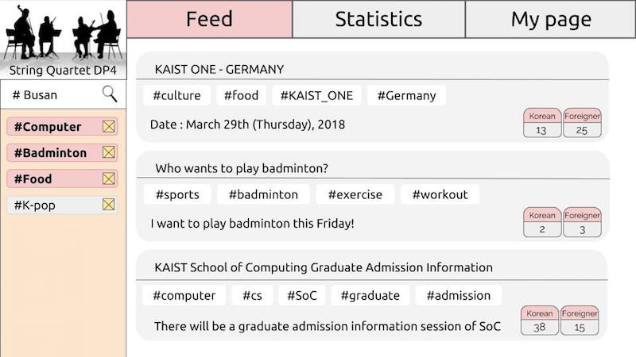

Team name: String Quartet

# POV

Exchange students in KAIST need a way to meet and spend time more easily with KAIST domestic students, because language barrier and isolated channel for communication make exchange students hard to come up in KAIST domestic student society.

# Tasks

- Find an event visiting Busan and when the people will go to Busan.
- Find how many people are interested in the tag that has the highest preference.
- Find how many undergraduate students are interested in computer.

# Prototype

## Link

https://invis.io/RAGQJ57ENUJ

## Prototyping tool

We used InVision to create Low-Fi prototype.

- What worked well with InVision
  - Easy to create hyperlinks
  - Quick change between screens without loading time
- What didn't work well with InVision
  - No hovering and clicking on a same object
  - Several basic functions widely used in web is not supported e.g. scroll down 

## Design choices (things that we didn’t implemented intentionally)

- Tag list is not consistent when a user change and move across pages.
  - In order to make tag list consistent throughout a session, it should be stored in database (backend.)
- No ‘My page’ screen
  - To explain why there are tags in the tag list, we are supposed to implement ‘My page’ screen. However, since it is not directly related with the tasks, we did not implement it yet.
- Hovering needs to show detailed information, but in the prototype hovering is only implemented on the components that are related to our tasks.
  - Adding different hovering screen is not important and requires too many screens to implement in the InVision.
- Input text in tag search bar 
  - Our original design intention is to allow users to type freely in the search bar and autocomplete feature kicks in, but we were not able to do it in InVision. As an alternative, we decided to use hover functionality of InVision.

## Screenshots

This is the main page when a user first open the website.

When a user (or prototype tester) hovers their mouse over the search bar, “Busan” keyword appears. Our original design intention is to allow users to type freely in the search bar and autocomplete feature kicks in, but we were not able to do it in InVision. As an alternative, we decided to use hover functionality of InVision.

After the ‘Busan’ tag is added, user can scroll down to see more events. In InVision, scrolling is not implemented but user can click the lower side of the scroll bar.

This is the result when the page is scrolled down.

When a user clicks the event, they can see the detailed information about the event. Here, user can translate the contents to their mother language. The language setting is saved and changed on MyPage screen, yet it is not implemented.

The translated version is shown. Translation is powered by Google Translator.

This is the screen that is shown when user clicks Statistics tab. As a default, top 5 preferences’ tags are shown. When a user hover their mouse on the graph bar, the exact number will be shown at the right of the bar.

When a user scrolls down the screen, the detailed statistics of specific tags are shown. Since “Computer” tag is activated on the Tag List, that tag’s information is shown. When a user hover their mouse on the pie, the exact number will be shown next to the pie. Scrolling further down will show information of “Badminton” and “Food” tags but they are redundant for prototype.

# Observations

- (task 1) Look for the exact date of events
  - Theme: Flexibility & Efficiency
  - Criticality: low
  - Participants who ran into this problem: P1
  - Improvement plan: Show dates of the events in the fixed place.
- (task 1) Hard to distinguish the activated and inactivated tags
  - Theme: Match between system and the real world, help and documentation
  - Criticality: mid
  - Participants who ran into this problem: P1
  - Improvement plan: Make inactivated tags much more invisible by make them white or strike out - or we would use checkbox.
- (task 1) Confuse the logic of the tag list. Participant misleads it as ‘AND’ operator but the real logic is ‘OR’
  - Theme: Match between system and the real world
  - Criticality: high
  - Participants who ran into this problem: P3
  - Improvement plan: Change selection method in tag list to use checkbox, rather than the tag box itself expresses selection. (Currently the tag is activated/deactivated by clicking it, but we will add additional checkbox next to the tag)
- (task 1) Keep click ‘busan’ tag on tag list when finding an event regarding ‘busan’
  - Theme: Visibility of system status
  - Criticality: high
  - Participants who ran into this problem: P2
  - Improvement plan: This is because activation functionality is not implemented in the low-fi level. As we planned, if clicking tag changes its color, they might understand the tag selection functionality.
- (task 1) Don’t notice what has changed at first after adding Busan (even though the posts are added)
  - Theme: Visibility of system status
  - Criticality: mid
  - Participants who ran into this problem: P3
  - Improvement plan: We may sort events on the feed screen based on the time when the tag is added, such as events that are related to recently added tag are pulled to upper side of the feed. 
- (task 1) Hard to notice the translate button
  - Theme: Aesthetic and minimalist design
  - Criticality: low
  - Participants who ran into this problem: P2, P3
  - Improvement plan: make the button more noticeable by color it red 
- (task 2) Don’t know how to find explicit number of people in statistics page
  - Theme: Match between system and the real world
  - Criticality: low
  - Participants who ran into this problem: P2
  - Improvement plan: Hovering is not straightforward. As participant attempts several times to click the bar, clicking would replace hovering. Or, displaying the explicit number together once the page is loaded.
- (task 2) Confuse the meaning of Korean/Foreigner number shown in each event as preference of tag belongs to that event
  - Theme: Consistency and standards
  - Criticality: mid
  - Participants who ran into this problem: P1
  - Improvement plan: Use clearer verbal description and specify their units.
- (task 3) Confuse when statistics of “computer” comes first when they scroll down the main statistics screen
  - Theme: Match between system and the real world
  - Criticality: high
  - Participants who ran into this problem: P2, P3
  - Improvement plan: The page that shows detailed statistics page for a particular tag should be open by different trigger, such as clicking tag from the event in the feed page. 
- (task 3) Don’t notice the detailed statistics page is for particular tag. Instead, think of it as for general tags.
  - Theme: Visibility of system status, match between system and the real world
  - Criticality: mid
  - Participants who ran into this problem: P1, P3
  - Improvement plan: The page that shows detailed statistics page for a particular tag should be open by different trigger, such as clicking tag from the event in the feed page. We would change ‘Statistics’ page into ‘Popular’ page which shows top5 tags and events.

# Paper vs Digital

- In terms of types of usability issues participants helped us to identify
  - Learnability: In digital prototype, we were able to test if the button is designed properly and it looks like it is a clickable object. On the other hands, in paper prototype, user asked us “Can I click this? Is this a button?” which implies that it is hard to express and test clickability using paper.
  - Safety: In paper prototype, we could not block users from searching unavailable tags but in digital prototype, we were able to make users only search for available tag by autocomplete. In other words, we enforced users not to perform invalid actions in digital prototype.
  - Efficiency: In paper prototype, it took time to change the screen because the computer was actually done by person. However, in digital prototype, we already implemented the screen for each action, which makes testing session faster.
  - Learnability: In paper prototype, tag activation/deactivation was implemented with a highlighting frame. Whereas, in digital prototype, due to the limitation on Invision, this was not implemented. This raises a learnability issue: when he/she attempts to find a tag statistics, participant repetitively click on related tag, instead of entering statistic column. 
- In terms of participants' reaction and expectation to prototypes
  - In paper prototype testing, users seem to be more careful to find the correct path to the answer, rather than freely use the prototype. A participant asked us after clicking ‘Statistics’ button, “Is this correct? Am I doing right?” On the other hand, users tend to be more experimenting with digital prototype than paper prototype. 
  - In paper prototype testing, users tend to more speak out their thoughts - even we didn’t ask a lot. One participant during paper prototype test was keep saying things like “I’m gonna click this because there are no buttons that seem to be related to the task,” etc. We believe this is because participants are more engaged with human during paper prototype. On the other hand, users were more quiet in general when they using digital prototype. 
- Changes we made in the digital prototype based on the feedback from paper prototyping testing
  - In the paper prototype, a user tried to click the main logo and asked us what will happen. However, we didn’t decide what should be done on the page when the main logo is clicked. From this feedback, we added functionality on main logo to go to the first screen in our digital prototype.
  - In the paper prototype, there was no index of Top 5 Preference graph. Users did not understand what the number exactly meant. So in the digital prototype we added the index ‘number of people’ below the graph.
  - In the paper prototype, nothing happened when the user click the bar of the Top 5 Preference graph. We added the functionality that if the user hover on the graph bar, the exact number of the people will be shown. 
  - In the paper prototype, when the user tries to search the tag on the Tag Search Bar, there was no autocomplete functionality. Since we need autocomplete function to avoid tag collision, we decided to use hover functionality for the fake autocomplete. 
  - In the paper prototype, there was a paper slip of different color to indicate the activation of the tag. Since users did not clearly notify the difference between the activated and deactivated tags, we used more understandable method on visualizing the activation of tags using the different color of the tag. 

# Studio Reflections

In the studio presentation, we have questions and comments on “tag” and “event”, on their way of presenting and their functionality. In case of tag object, firstly, one of audience misleads how come tag could be present in the Tag List. Tags can be pre-assigned to the tag list based on the tag preference data you put when you initially create your account. Thus, the tags which reflect one’s personal preferences would be shown in the Tag List. We will implement this sign up process for our later prototype so that users can understand the meaning of tags in tag list.

Second, they reasoned the necessity of classifying tags into two different colors, pink and gray. This is because our concept of Tag List is like a shopping cart in an online shopping website in that, all tags the user’s interested in are pre-included in the tag list, but once you want to search for specific tag for finding an event, then you could select or deselect tags based on your needs at the very moment. Deleting/adding would confuse the user as tags are disappeared/reappeared in the Tag List, which hinders one to follow up which tag was originally in the Tag List. Moreover, it is not effective in terms of user’s time and effort as one might manually delete/add the feature. So we agreed that tags that the user’s interested in should be remained in the Tag List, but for ease of searching an event, the user is allowed to select/deselect the tag, instead. We will make it more distinguishable between activated tag and inactivated tag by using strike, for example.

Third, some of audiences who’re introducing tag to UI of their own questioned its concept in our case, and we tried to distinguish concept and functionality of Tag in our case from that in their group. First of all, unlike their tag pool, our tag pool dimension is limited. User is only allowed to choose among predefined pool of tags and this would be supported by autocomplete. Also, simultaneous activation of tags doesn’t mean ‘AND’ as usual, but rather it’s more like ‘OR’; that is, if two tags are activated at once, our feed shows several posts including one of those two tags. They mislead it as ‘AND’ operator as all tags are displayed as same (in a pink small frame). We would find new solution on its visual representation in the way that user would recognize the nature of tag relationship as ‘OR’ instead of ‘AND. Lastly, in our realm of definition, tag functions as both category and key(hash). It is because, once we discuss about creating a hierarchy of all kind of events (categorizing into sports instead of listing raw contents such as badminton or basketball), we found it very difficult in terms of data managing because the tree hierarchy could be frequently changed if new tag is introduced and finds along tree hierarchy for its proper position. So we decided to simply linearize tags so that all tags are not in hierarchy, and rather in parallel position. We use tag as category or key for a post as long as it is correlated, and we can use it in searching a post as well. As our functionality is finding an event that you are actually interested in it, we didn’t think that categorizing events are not a good idea. 

Next, audience mostly questioned whom might have authority to write the event posts. We’re planning 1) to include all posts notified in KAIST portal as it was an issue in previous needfinding, and 2) to provide user a authority to create post by themselves while the later idea is still on debate. In case of 1), we don’t have technical solution yet to reach and fetch those information to our service. It could be a laborious work to move all information manually or perhaps there could be an automatic job to pull those information. And there’s a comment that the whom in charge of this service would be the qualified one if we later decide to copy and paste postings manually. Regarding 2) we are in discussion stage on its UX and UI. It has way more complicated dynamics which could not implemented in this lo-fi stage. Also, there’s comments on the minor details including sorting/aligning the event postings, previewing the events using small image, matching the date format in every postings.   

Finally, there was a comment to rethink our service in the level of needfinding. Implementations that would fit solely to our target user should be considered and introduced more. For example, a new object providing a more specified statistical information on participators of each event would help user to on their decision to participate. The information achievable from the prototype in the studio session doesn’t tell, for instance, how many domestic students are coming, hence not providing direct help on user’s decision on event participating. We reflected this comment in the our low-fi prototype and would further discuss every objects in more detail from the stage of needfinding. 

In summary, most of questions and comments raised on functionality of an object as that of our own is slightly inconsistent with that used in usual cases. We would try to overcome the inconsistency and find other solutions on the object definition and representation. Moreover, we would rethink the necessity and sufficiency of every object from the stage of needfinding. 

