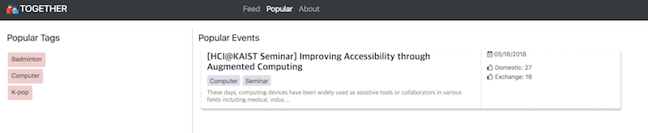

Team name: String Quartet

# POV

Exchange students in KAIST need a way to meet and spend time more easily with KAIST domestic students, because language barrier and isolated channel for communication make exchange students hard to come up in KAIST domestic student society.

# Target users

Our target users are exchange students in KAIST.

# Tasks

- Find the event that contains “Traveling to Busan” and the place they are going to meet. 
- Create an event related to the popular tags.
- Find how many undergraduate students are interested in “food.”

# Prototype

### URL

https://saelyne.github.io/StringQuartet/index.html

### Github Repository

https://github.com/saelyne/StringQuartet

The repository is changed to private repository since we included config file for connecting Firebase into the repository. We first removed config file from the repository by adding it to .gitignore, but this broke our prototype URL. If you have difficulties accessing the repository, we are welcome to give you authority to the repository.

### Libraries and Frameworks

- JQuery
- Bootstrap
- Firebase

### Assumptions

- To minimize the implementation on backend, we assumed that user has already signed up for our website with following information: exchange student, undergraduate, male, 23, interested tags - Busan, Badminton, Food.
- We planned to use Google Translate API for our translating feature, but since it costs money, for the prototype we translated the text beforehand using Google Translate ourselves and then stored the translated text in the database. When the translate button is clicked, instead of translating it at that moment using the API, the pre-translated text stored in the database is displayed.
- For the Popular page, the popular tags and events were meant to be displayed based on the users’ interest of tags and events but since we don’t have that many users and it requires many backend works, we just chose the random tags and events to show on Popular page.

### Screenshots

This is the main page when a user first open the website.

If the user tries to add the tag which is already on the "My Tag", the alert message shows that user cannot add the tag.

If the user tries to add the tag, the autocomplete is shown.

When the tag ('Computer') is added, the tag is placed on the very top of the "My Tag". And the events related to the tag ('Computer') is also placed on the top. 

When the user scrolls down the page, then the navigation bar and "My Tag" are fixed and the only Event goes down. 

If the user hover the tag on "My Tag", the close button appears for deleting it.

If the user click the remove button on the tag, the tag is deleted and the events that has the tag is also removed.

If the user click the event, the detail page is shown.

If the user click the 'TRANSLATE' button, the detail information is translated to English.

If the user click the heart icon, the icon changes and increases the number of people who are interested in that event. 

If the user click the + button on the page, the page for adding an event is shown.

If the user click the Date button when making a new event, the calender is shown.

The autocompletion of the tag is also done when making a new event.

When the user does not type all the required information, the user cannot make an event. 

If the user click the tag on the main page, the statistic of the tag is shown. 

When the user hover the statistic of the age, the number of people with those age is shown.

This is the main page of the Popular Tab. A user can click tag to see statistics or card to see detailed information, similar to the Feed page.

### Important design practices we included

- Autocomplete of tags: Since our project has predefined set of tags, we need to enforce user not to type in wrong tags or tags that don't exist. Therefore, we implemented autocomplete for all input fields that ask for tags. An alert is shown when a wrong tag is given as an input.
- Removal of tag from tag list: On the left side of the 'Feed' page, there's a user's chosen tag list. We allowed the user to remove the tag from the list when they are not interested in the tag anymore. However, we decided not to show explicit "X" button but show the button when the mouse is hovered on the tag.
- Use of similar color: We chose pinkish color and use similar color codes in statistics page.
- Order in feed page: When a user add new tag, the tag is added to the top of the tag list. Also, we sorted events on the feed based on the order of the tags in tag list. With these two mechanics, events that contain the tag that is added most recently are shown top of the feed, thereby making users easily find new events that are added.
- Preloader animation: Since our service takes some time (more than 1s in our test environment) to fetch data from database, we included animation when a user refreshes the page in order to give them feedback.
- Safety: The tag list is preserved upon refresh. It is saved in Firebase.
- Use of icons: We used icons for date and interests on event.
- Scrolling: The tag list and navigation bar are fixed when a user scrolls down. Only feed area is scrolled.
- Translation: At first, we were planning to use external API to translate card contents that are written in Korean. However, we found that Google translate is not a free service, so we just added translated contents in Firebase (since this is a prototype.) Our interface has switch button that enables translation. This feature is added to support non-Korean speakers to understand events easily.
- Input validation: On the "create event" page, when the field is not filled out, the field is highlighted in red and submission is not confirmed. When a user fills the field that requires date, a JQuery datepicker is shown.

# Individual reflections

## Jaewon Jung

#### Which part of the UI did you directly contribute to?

- "Create event" page: includes input validation, datepicker, autocomplete
- "Popular" page
- Navigation bar
- Tag autocomplete when adding a new tag on the tag list
- Loading animation when a user first enter the website and waits for the data to be loaded from Firebase
- Showing cards sorted by the order of tag list
- The color of the card's summary of contents is set to grey, and if the summary gets longer it just shows "..." above certain length

In addition, the designs for card and tag list were decided upon all group member's consent (though the implementation itself is done by other members who are in charge of them.)

#### What were some of the difficulties you faced?

I spent a lot of time to fix the problem that the tag autocomplete feature is not visible on the "create event" page modal. The problem was that JQuery autocomplete has lower z-index value than the modal, so the autocomplete was being shown but it was hidden behind the modal (I was able to find this because when I clicked up/down arrow, the autocomplete worked.) This problem was fixed by adding style code that gives autocomplete a higher z-index value.

#### List one useful implementation skill you learned while working on DP5 and DP6.

My work has more weight on Firebase, and I learned and thought a lot about MVC model that we learned in the class. Experiences of creating interface that gets input from user and turning the data into model helped me to understand how interface and model are connected. 

## Dongmin Lee

#### Which part of the UI did you directly contribute to?

I made a tag list on the “My tag” and design the CSS effects of the tags like clicking or hovering. Also I made Popular page outline like adding the title, or drawing the vertical line.

I also made a sync with tags and events. For example, when the new tag is added, there should be event on the Event lists. And when the tag is removed, the events that has the tag should be also removed.

#### What were some of the difficulties you faced?

I had difficulty when ordering the card events and filtering the events. The events should be filtered with the tag. Also, we had to consider the order of the event. If the user adds new tag to the tag list, the events that have the latest added tags should be placed on the top. So to solve this problem, we decided to go through the events database and get the tags of the events, and place the events that have the tags.

#### List one useful implementation skill you learned while working on DP5 and DP6.

I learned about linking website and firebase. First I did not know about dealing with data. Programming assignment was my first time to access the firebase. And doing the DP5 and DP6, I learned more about dealing with firebase and the website. Also, while the effects of hovering was not done in programming assignments, by making hover effects in CSS file I learned the implementation of hovering and other effects. 

## Saelyne Yang

#### Which part the UI did you directly contribute to?

I mainly worked on designing post cards shows on Feed page and post detail modal which pops up when clicking the post cards. Additionally, I worked on designing search bar, card plus button and logo.

#### What were some of the difficulties you faced?

Since post cards include a lot of information - title, date, tags, likes, summary and contents - it was hard to locate them properly so that the users don’t confuse each element and don’t be overwhelmed by too much information. To help users understand better, I used icons for date and likes and separate them from the contents-related things such as title, tags and summary. Also, since post cards and its detail modals have lots of text, it was hard to adjust the line-height so that the users can clearly get and itemize the information. I also needed to consider the case where the title overflows so it appears in 2 lines. Also, since each Korean and English characters have different height so I had to consider the appropriate line height which applies to both characters well. Additionally, I had to think about color of search bar, plus button, and the logo to have consistent theme of colors.

#### List one useful implementation skill you learned while working on DP5 and DP6.

In our prototype, we have two clickable areas in one post card - one is the post itself and the other one is tag(s). Since two areas are overlapped, when I clicked a tag, our prototype perceived as both “card” and “tag” are clicked and showed two modals - details and statistics. To solve this problem, I searched for it and learned how to differentiate clicks on a div and clicks on a nested div within it. The most common (and suggested) solution is to use stopPropagation() function. It stops propagating the input events as we learned in previous class. However, this didn’t apply to our code for some reason so we thought of another solution - which is using boolean value! Initialize the boolean value as False and once the tag button is clicked, change this value to True. Then, for every input of clicking the posts, check if the boolean value is true or not and in case of true, do not display the detail modal and then change back the boolean value to False. By doing this, we could handle each input click on overlapped area.

## Seohui Bae

#### Which part of the UI did you directly contribute to?
I initially worked on the fundamental function and design of three pop-ups in the feed page. The popups are designed to pop up once clicking a certain button and disappear when clicking either ‘X’ button or background of the modal window. For the rest and most of the time of work, I focused on the implementation of tag statistics feature. This includes fetching statistical information from database, and displaying those numbers in well-visualized format (in this case, pie chart and bar graph). 

#### What were some of the difficulties you faced?
I spent much of my time trying to handle open and close event of modals. As two windows are overlapped on the window, onclick event of certain area often displays both two windows at once. Also, close events are properly working on some case but not all the time. This issues make me to rethink and study the z-index and event handler dynamics discussed in the in-class activity.

#### List one useful implementation skill you learned while working on DP5 and DP6.
In order to build the frame of pie and bar graph, an active interaction between HTML, CSS and JS was required. As building up the frame, I, finally, was able to get used to pass and receive arguments to and from other languages in a proper(understandable) format. For instance, it barely happens to pass any of values in HTML to JS besides using the notation ‘this’ with event handler. From repetitive trials, I was finally able to pass the value of the child element in HTML using some tricks; that is to change the whole element into a string the split in order to get the proper value of string. Understanding the underlying dynamics would help me implement new feature in a shorter time in future. 

# Studio Reflections

In the studio, there were few questions on the meaning and necessity on several features in the prototype. One of the audience questioned the meaning of “show interest” button in the detailed modal of an event card. We answered its exact functionality; that once user click on the show interest in the detailed page, the numbers of either domestic or exchange on the corresponding event card is incremented by 1, referring to the information where the user’s belonging to. Also, some reasoned the necessity of “tag statistics” feature. He wondered whether the user really need the statistical information of every tags. However, it is a required process that has to be proceeded in advance of organizing an event because if someone create an event and nobody joins, then there’s no reason to organize the event. As a property of event someone plans to create could be something that most people don’t really interested in, and the property is reflected in the tag, tag statistics would be a helpful information for event organizer. Additionally, someone asked the way popular page is implemented. More precisely, how the system is designed to collect all the user information and display them in the right order. We decided not to collect all the user information as it is related to the log-in feature, which is neglectable in the prototype stage. We did not fully implement the backend part and would not in further. Instead, we would display random tags or cards on the popular page for instance.

New features were suggested as well. First, few suggested a feature that enables user to rearrange all the cards in the feed page either by dragging or enabling sort-by option, as currently, we have only one sorting standard, the tag list as a stack of tags. We already discussed the necessity of sort-by function and concluded that it would make our system difficult to use. This is because the rule to align the newly added card to previously cards and sorting rule would collide and is difficult to handle. Assume the user adds a new tag to sort-enable tag list and changes filter or sorting order. Then the event cards would be ordered in that order. The problem is, if the user adds another tag afterward, then there’s no solution to order all cards in a concrete and easily understandable way. To minimize the complexity of the functionality implemented in our system, we decided to exclude the rearranging feature. Moreover, there’s a suggestion to pop up “tag statistics” feature from other page, in this case “event create” modal, as well. This was because the statistical information is indeed useful for event organizer and at the timing of event creation. We agree to misalignment of the need and prototype displaying, thus we would further consider to reposition or double-position the given feature. 

