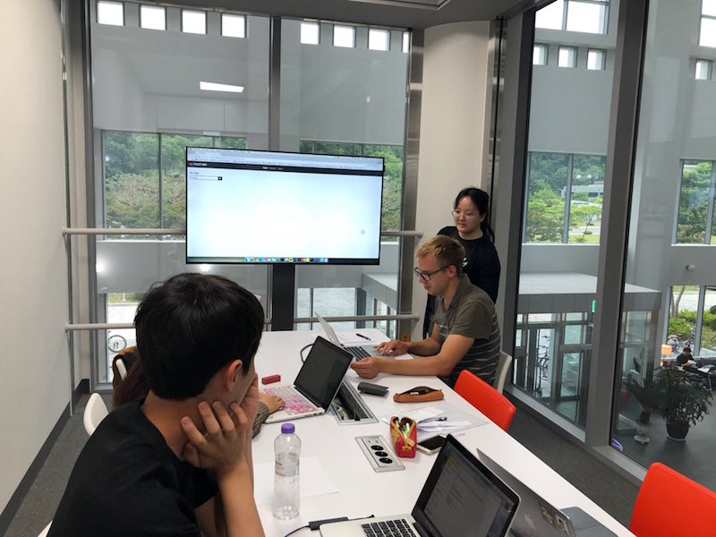

Team name: String Quartet

# Written Protocol

### Preparation instructions

- OS: OS X
- Browser: Chrome
- Webpage to open: https://saelyne.github.io/StringQuartet/index.html
- Open Quicktime player to record screen.
- Initial tag list: Empty

### Introduction and informed consent (this is written down and be shown to participants)

In this project, we are trying to provide easier ways for exchange students to meet and spend time more easily with KAIST domestic students, because language barrier and isolated channel for communication make exchange students hard to come up in KAIST domestic student society. In order to achieve this, we are designing a new website. In our website, users are able to create events and search for existing events using ‘Feed’ page by different tags. Users are also able to get statistical information using tags. In this testing session, you will be asked to finish four tasks by going through these functionalities. If you think you’ve done each task, please let us know verbally.

During the test session, we will be recording voice and screen. Also, we will take photos. Do you agree?

All recordings will be deleted before this Thursday. They will be used to review and find usability issues in our prototype. The recordings will not be revealed to other people except our group.

This test session is to discover usability issues in our interface. If there’s any struggles, it is indeed a problem of our system not that of yours. Please feel comfortable and do not hesitate to ask if you have any questions. Also, it will be very helpful for us if you talk aloud what you think about the interface at every moment.

### Tasks and instructions (this is written down and be shown to participants)

- Find at least 5 predefined tags.
- Choose one tag you like. Find an event that is related to that tag.
- Find how many undergraduate students are interested in that tag.
- Create a new event.

### Recording strategy

- Recording
  - Voice recording
  - Screen recording
  - Notes from observer
- Role of each member
  - 1 facilitator (with handling tech problems if occur), 3 observers
  - Test 1 facilitator: Seohui Bae 
  - Test 2 facilitator: Jaewon Jung
  - Test 3 facilitator: Dongmin Lee 

### Questionnaires

We have two types of questionnaires; one in scale of 1-5, one in short answer questions.

- Scale of 1-5 questionnaire (adapted from https://thenextweb.com/dd/2014/12/23/20-creative-ways-test-design/)
  - Overall, I am satisfied with how easy it is to use this system.
  - It was simple to use this system.
  - I was able to complete the task and scenarios quickly using this system.
  - I felt comfortable using this system.
  - It was easy to learn to use this system.
  - I believe I could become productive quickly using this system.
  - The system gave error messages that clearly told me how to fix problems.
  - Whenever I made a mistake using the system, I could recover easily and quickly.
  - It was easy to find the information I needed.
  - The information was effective in helping me complete the tasks and scenarios.
  - The organization of information on the system screens was clear.
  - The interface of this system was pleasant.
  - This system has all the functions and capabilities I expect it to have.
  - Overall, I am satisfied with this system.
  - I believe this system helps me to meet and spend time more easily with KAIST domestic students.
- Short answer questions (These questions will be printed on paper and we will ask participants to write down.)
  - Which functionalities were hard to understand?
  - Which parts in our interface were hard to discover?
  - While using our interface, what are the parts that didn’t aligned well with your expectation?
  - Which function did you like the most? 
  - Any suggestions on interface?
  - Any suggestions on minor details?

### Debrief

Thank you for participating our user testing. Your participation helped a lot.
Please leave your kakaotalk ID to receive a coffee coupon.

# Session Observations

All participants are exchange students and were found in library. We asked them to help us testing.

### Participant 1 (P1)
- Age: 21
- Gender: Female
- Nationality: India
- Dept: Biological Science
- Status: Undergrad student, 3rd year

### Participant 2 (P2)
- Age: 23
- Gender: Female 
- Nationality: Norway
- Dept: Physics
- Status: Grad student, 1st year

### Participant 3 (P3)
- Age: 26
- Gender: Male
- Nationality: Finland 
- Dept: Computer Science
- Status: Grad student

# Usability Lessons
- (Task 3) User doesn’t find out the fact that when clicking a tag on the card, tag statistics page is shown.
  - Theme: Help & documentation
  - Criticality: high
  - Participants who ran into this problem: P1, P2, P3
  - Improvement plan: We should change the way to open the page that shows tag statistics. One simple solution could be changing button’s visual design so that user can expect something will happen if the button is clicked. More complicated solution might be redesigning the whole interface so that the way of showing tag statistics page is completely changed.
- (Task 1) If a user types an invalid tag too fast, the autocomplete shows nothing since there are no matching tags, thereby not telling any useful information about existing(predefined) tags.
  - Theme: Visibility of system status
  - Criticality: high
  - Participants who ran into this problem: P1, P2, P3
  - Improvement plan: Show the entire list of predefined tags if nothing is typed or nothing is matched.
- (Task 3) Users are confused between event statistics and tag statistics
  - Theme: Consistency & standards
  - Criticality: medium
  - Participants who ran into this problem: P1, P2, P3
  - Improvement plan: The representation of statistics should be unified. The problem we think here is that two similar pieces of information is differently represented.
- (Task 1) The character "#" in placeholder makes users confused about how to use tags.
  - Theme: Consistency & standards
  - Criticality: low
  - Participants who ran into this problem: P2
  - Improvement plan: Remove "#".
- (Task 4) Try to fill the second and third tags when creating event which is optional.
  - Theme: Error prevention
  - Criticality: medium
  - Participants who ran into this problem: P3
  - Improvement plan: Change the design to show that second and third tags are not necessary. 
- (Task 4) Try to add tag with # when creating an event
  - Theme: Consistency & standards
  - Criticality: high
  - Participants who ran into this problem: P2
  - Improvement plan: Remove # on the search bar. 
- (Task 1) Since the initial status of the tag list was empty, users did not know which tags exist.
  - Theme: Visibility of system status
  - Criticality: high
  - Participants who ran into this problem: P2, P3
  - Improvement plan: When the user click on the search bar, nothing appears. So when the user click the search bar, tags should be appeared. 
- (Task 3) Users misunderstood the like button next to the number of likes by domestic and exchange students as clickable
  - Theme: Consistency & standards
  - Criticality: low
  - Participants who ran into this problem: P2
  - Improvement plan: Modify how the number of likes are shown 
- (Task 4) When users type invalid tags while creating an event, the event is not posted without any warning message
  - Theme: Error prevention
  - Criticality: high
  - Participants who ran into this problem: P1, P2, P3
  - Improvement plan: Show warning message and make users type valid tags
- (Task 4) Users could not find “create an event” button easily
  - Theme: Visibility of system status
  - Criticality: high
  - Participants who ran into this problem: P2
  - Improvement plan: Modify the position of "create an event" button

# Plan for iteration

We will implement followings.

- When creating a new event, it should be blocked when an invalid tag is given as an input.
- When creating a new event, tell users that 2nd and 3rd tag input fields are optional.
- Remove hash character ('#') from tag search bar.
- Autocomplete should be more useful (e.g. show all tags existing) when nothing is matched with current input.
- When the user's tag list is empty, add interface that tells more to user about adding tags.
- Change the location of the "create event" button since it is invisible depending on the resolution of the screen.
- Show statistics in different way. (Change the way to find statistics.)

# Studio Reflections

In the studio, we were asked about the participant, consent on the recording, dimensions that questionnaire and short answer questions cover. One of the audience asked how to recruit participant. In all of the cases where we’re looking for a participant to test the prototype, we recruited an exchange student (our target user) who are working around in the library. Moreover, there was a concern on the details of the consent on the recording. We basically recorded screen and voice as well during the testing session as video recording is not welcomed in usual user testings. But all of the recordings containing personal information should be expired in some sense. Thus, based on this comment, we further revised our form of consent to inform that all recordings would be expired in 5 days (in the user testing at 27 May, the expiration date was announced as 31 May). Furthermore, one of the audience commented that questionnaire and short answer questions would cover not only usability, efficiency, learnability feature but also the purpose of the prototype itself. Thus, we added one question in the questionnaire, as "I believe this system helps me to meet and spend time more easily with KAIST domestic students", so that the user justifies whether our prototype is fit to the fundamental goal.
